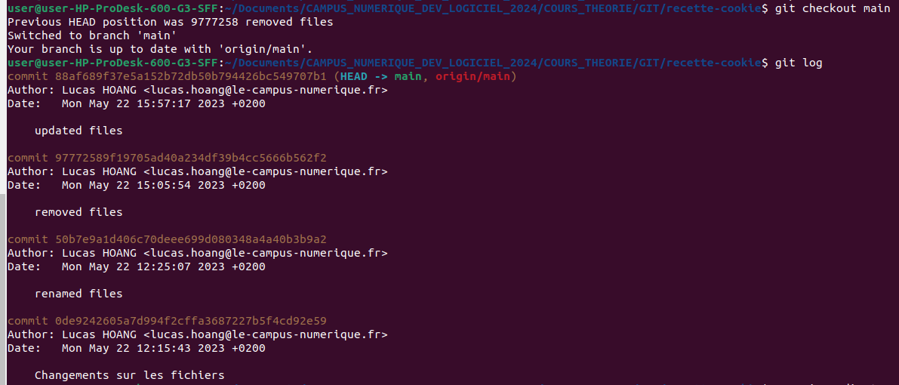

## Screenshot Preuve de travail

## Screenshot "Revenir à une étape antérieur"

## Screenshots "Récupérer la version à jour du projet, la plus récente"
Avec la méthode GIT PULL

Avec la méthode GIT CHECKOUT MAIN

## Screenshot "Git Tag"

